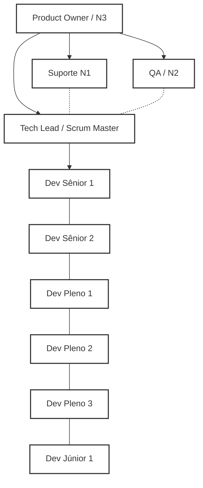

# Plano de Estrutura e Operação da Equipe de Desenvolvimento

## 1. Estrutura da Equipe

Minha proposta é um plano de desenvolvimento estruturado e quantificado para uma equipe de 10 pessoas. O objetivo é garantir que cada função estratégica esteja contemplada, promovendo eficiência, qualidade e colaboração em todo o ciclo de desenvolvimento de software. Este plano foi desenhado para atender às demandas do negócio e criar um ambiente de trabalho claro e produtivo para todos.

| Função                     | Qtde |
|----------------------------|:----:|
| Product Owner (PO) / N3    |  1   |
| Tech Lead / Scrum Master   |  1   |
| Quality Assurance (QA) /N2 |  1   |
| Suporte N1                 |  1   |
| Dev Sênior                 |  2   |
| Dev Pleno                  |  3   |
| Dev Júnior                 |  1   |

---

## 2. Organograma da Equipe

- **PO/N3**: Foco no negócio, backlog e visão macro
- **TL/SM**: Liderança técnica, execução, integração e publicação
- **QA**: Garantia de qualidade, critérios de aceite e testes
- **Suporte N1**: Atendimento inicial, feedbacks e base de conhecimento
- **Devs**: Execução técnica, reviews, entregas e crescimento

---

## 3. Comitê de Melhoria

### **Composição**
- Tech Lead/Scrum Master
- Especialista externo (consultor técnico/negócios)
- Analista externo (consultor de processos, UX ou negócio)

### **Objetivo**
Atuar como consultores estratégicos para identificar, sugerir e acompanhar melhorias contínuas em:
- Produto (funcionalidades, performance, segurança)
- Processos (fluxo de trabalho, comunicação, ágil)
- Qualidade (testes, automação, incidentes)
- Experiência do usuário (UX/UI)

### **Funcionamento**
- Reuniões periódicas (ex: mensal ou bimestral) para revisão de processos, resultados e métricas.
- Análise de indicadores (bugs, incidentes, retrabalho, satisfação do usuário, lead time, etc).
- Levantamento de pontos de melhoria junto ao time e stakeholders.
- Registro de propostas de melhoria e acompanhamento de implementação.
- Geração de relatórios e recomendações para a liderança.

### **Responsabilidades**
- **Você (TL/SM):** Apresenta contexto técnico, status do time, desafios e resultados.
- **Especialista:** Traz visão externa, tendências de mercado, boas práticas técnicas.
- **Analista:** Foca em processos, experiência do usuário, fluxo de atendimento e comunicação.
- **Time:** Participa com feedbacks e executa melhorias aprovadas.

---

## 4. Destaques das Responsabilidades

### Product Owner (PO) / N3
- Lidera backlog, requisitos e priorização
- Atualiza roadmap no Redmine
- Toma decisões de negócio e N3
- Lidera QA e Suporte

### Tech Lead / Scrum Master
- Lidera tecnicamente o time
- Remove impedimentos e faz mentoring
- Facilita cerimônias ágeis
- **Responsável por toda a parte ágil do projeto (planejamento, execução, acompanhamento e melhoria contínua das práticas ágeis)**
- **Publica as versões em Produção ao final de cada sprint**
- Aprova PRs e garante qualidade técnica
- Integra o macro (Redmine) e micro (Azure DevOps)

### Quality Assurance (QA)
- Elabora e executa testes (manuais e automatizados)
- Valida critérios de aceite das entregas
- Reporta bugs e gera métricas de qualidade
- Atua como Suporte N2 sempre que não houver itens em "QA To Do" no quadro Kanban
- Responsável pelo fluxo QA no Kanban: movimentação dos itens entre "QA To Do", "QA Doing" e "QA Done"

### Suporte N1
- Primeira linha de atendimento
- Registra chamados e incidentes
- Mantém base de conhecimento

### Desenvolvedores
- **Sênior:** Liderança técnica e desafios complexos
- **Pleno:** Execução e apoio aos pares
- **Júnior:** Execução de tarefas simples e aprendizado

---

## 5. Ferramentas e Integração

- **Redmine:**  
  - Utilizado pelo PO para gestão do roadmap, releases e visão macro.
  - TL/SM ajuda na transição para execução detalhada.
- **Azure DevOps:**  
  - Utilizado pelo time para detalhamento, execução e acompanhamento de sprints.
  - TL/SM lidera o detalhamento, planning e execução.

---

## 6. Nosso Fluxo de Trabalho

1. **Planejamento Macro**: PO detalha roadmap no Redmine.
2. **Quebra Operacional**: TL/SM transforma o macro em histórias/tarefas no Azure DevOps.
3. **Execução da Sprint**:  
   - Time executa e QA valida.
   - TL/SM remove impedimentos e aprova PRs.
4. **Deploy**:  
   - **TL/SM publica versão em Produção ao fim da sprint.**
5. **Feedback & Melhoria**:  
   - Suporte coleta feedbacks e incidentes.
   - Ajustes e aprendizados alimentam próximas sprints.

---

## 7. Exemplos de Tarefas por Perfil

- **PO:** Priorizar épicos, validar entregas, revisar roadmap
- **TL/SM:** Aprovar PRs, publicar produção, remover impedimentos, mentorar devs
- **QA:** Executar testes, automatizar, reportar bugs
- **Suporte:** Atender chamados, atualizar base de conhecimento
- **Devs:** Implementar features, participar de reviews, documentar

---

## 8. Observações Finais

- Comunicação aberta e colaborativa é chave!
- Documentação e processos sempre atualizados.
- Todos têm trilha de crescimento.
- Saúde do time é prioridade.

---

**Dúvidas, sugestões ou pontos de melhoria?  
Vamos juntos construir uma equipe cada vez melhor!**
