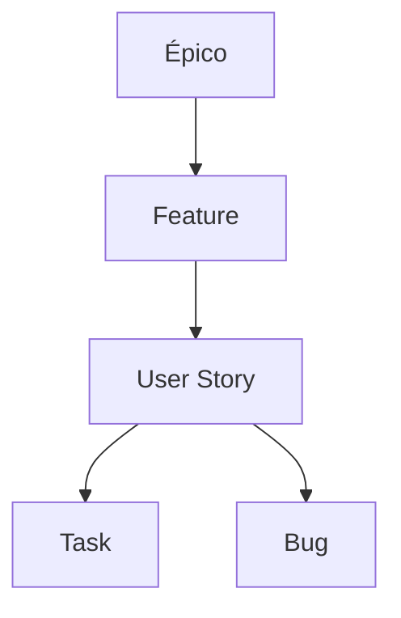

# Apresentação: Plano Geral de Organização e Operação do Time de Desenvolvimento

---

## 1. Distribuição de Horas por Papel (Sprint de 80h)

### Desenvolvedores

| Atividade                | %   | h/sprint |
|--------------------------|-----|----------|
| Programação              | 70% |   56     |
| Documentação             | 10% |    8     |
| Code Review / Apoio QA   | 10% |    8     |
| Rituais & Reuniões       | 10% |    8     |

### Quality Assurance (QA)

| Atividade                   | %   | h/sprint |
|-----------------------------|-----|----------|
| Testes Funcionais Manuais   | 50% |   40     |
| Testes Automatizados        | 20% |   16     |
| Reportar Bugs/Retestar      | 10% |    8     |
| Planejamento/Documentação   | 10% |    8     |
| Reuniões Ágeis & Rituals    | 10% |    8     |
| **Total**                   |100% |   80     |

### Suporte N1

| Atividade                    | %   | h/sprint |
|------------------------------|-----|----------|
| Atendimento Inicial          | 50% |   40     |
| Criação/Atualização de FAQ   | 15% |   12     |
| Relatórios e Indicadores     | 15% |   12     |
| Reuniões & Feedbacks         | 10% |    8     |
| Apoio ao QA/Devs             | 10% |    8     |
| **Total**                    |100% |   80     |

- **Obs.:** O QA assume o papel de Suporte N2 sempre que não houver demandas em "QA To Do". Os percentuais podem ser ajustados conforme maturidade e contexto do time.
- Estes percentuais são sugestões baseadas em sprint padrão de 80h (10 dias úteis, 8h/dia). Ajustes podem ser feitos conforme demandas, incidentes ou prioridades do ciclo.

---

## 2. Sprint e Rotina

- **Sprint:** 15 dias corridos (10 dias úteis)
- **Deploy:** Feito pelo TL/SM aos sábados (PO/QA acionados só em emergência)
- **Rituais principais:** Daily, Planning, Refinamento (opcional), Fechamento
- **Reservas para urgências:** 10-20% da sprint

---

## 3. Organização do Azure DevOps

- **Hierarquia:** Epic > Feature > User Story > Task > Bug  
  - Épico: Grande iniciativa ou macro funcionalidade.
  - Feature: Deliverable intermediário de um épico.
  - User Story: Unidade funcional, focada na entrega de valor.
  - Task: Item executável, granular.
  - Bug: Correção de erro identificado. Sempre que possível, crie o bug como **child da User Story** correspondente.
- **Kanban sugerido:**  
  - Backlog  
  - To Do  
  - Doing  
  - QA To Do  
  - QA Doing  
  - QA Done  
  - Done
- **Swimlane de incêndios/urgências:** bugs críticos sempre no topo
- **Itens bloqueados:** Indique como `blocked: true/false` dentro da própria User Story.

### Exemplo Visual de Hierarquia

### Boas Práticas Azure DevOps

- Sempre vincule tarefas e bugs à User Story correspondente quando houver relação clara.
- Preferencialmente, crie bugs como **child** da User Story, garantindo rastreabilidade.
- Bugs críticos devem ser destacados no board do time.
- Revisar backlog semanalmente para garantir que bugs filhos estejam sendo tratados junto à US.

### TO DO

- Definir marcadores (tags/labels) padronizados de identificação para Épicos, Features, User Stories, Tasks e Bugs.
- Exemplos de marcadores:  
    - `#epic`, `#feature`, `#userstory`, `#task`, `#bug`
    - Ou usar convenção de nomes nas descrições/títulos (ex: `[EPIC]`, `[BUG]`, etc.)
- Padronizar uso dos marcadores em todo o time.
- Documentar exemplos de uso dos marcadores em cards reais do board.

---

## 4. Política de Férias/Ausências

- Férias com 30 dias de aviso, backups definidos (ver tabela no documento completo)
- Nunca todos do mesmo papel ausentes ao mesmo tempo
- Ausências inesperadas comunicadas imediatamente

---

## 5. Remanejamento de Roadmap e Urgências

- TL monitora e comunica impactos ao PO
- PO ajusta o roadmap e comunica stakeholders

---

## 6. Boas Práticas Gerais

- Centralizar conhecimento, evitar dependência de uma só pessoa
- Documentação viva e acessível
- Transparência e comunicação ativa
- Cultura de colaboração e melhoria contínua

---

**Este documento complementa o plano principal, focando em governança, rotina e resiliência do time. Dúvidas ou sugestões?  
Vamos juntos aprimorar nossa operação!**