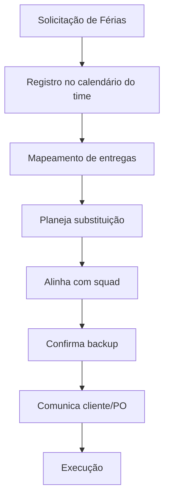
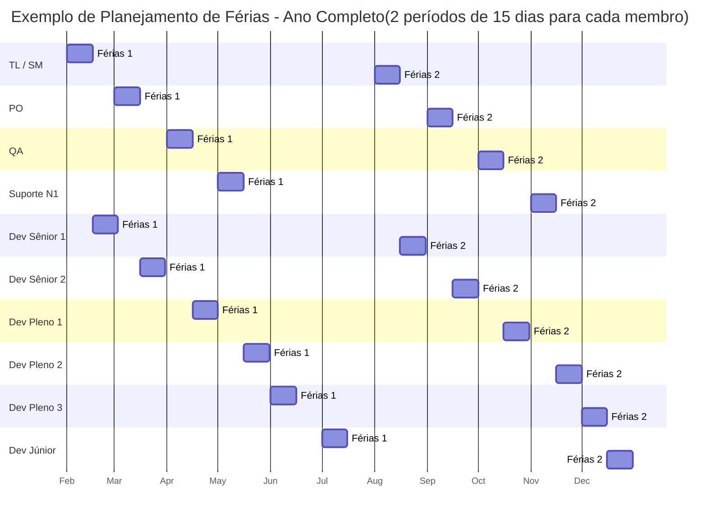

# Política de Férias e Ausência - Equipe de Desenvolvimento

---

## 1. Objetivos

- Garantir continuidade das entregas mesmo com membros ausentes.
- Minimizar impacto de férias, licenças ou ausências inesperadas.
- Promover transparência e planejamento antecipado.
- Mantener qualidade e bem-estar do time.

---

## 2. Comunicação e Planejamento

- **Férias devem ser solicitadas com no mínimo 30 dias de antecedência.**
- **Ausências não planejadas (atestado, emergência) devem ser comunicadas ao TL/SM e PO imediatamente.**
- O planejamento de férias será revisado trimestralmente pelo TL/SM e PO, levando em conta:
  - Períodos de maior demanda, entregas críticas ou releases.
  - Não permitir que membros-chave (TL, Sênior, QA, Suporte N1) saiam juntos.
  - Escalonar férias para sempre manter pelo menos 1 pessoa sênior disponível.

---

## 3. Processo Operacional

### **A) Férias Planejadas**

1. **Solicitação:** Dev comunica TL/SM e PO com 30 dias de antecedência.
2. **Avaliação:** TL/SM e PO avaliam impacto no roadmap/sprints e aprovam datas.
3. **Planejamento de Cobertura:**
   - Redistribuição de demandas nas sprints afetadas.
   - Escolha de “backup” para papéis críticos (ex: Sênior cobre TL, Pleno cobre Sênior, etc).
   - Atualização dos responsáveis no Azure DevOps.
4. **Documentação:** Checklist de passagem de bastão (tarefas em andamento, acessos, pendências).
5. **Comunicação:** Time é avisado do período e plano de cobertura.
6. **Execução:** Backup assume demandas críticas do ausente; TL/SM monitora a capacidade do time.

### **B) Ausências Não Planejadas**

1. **Comunicação imediata:** Dev avisa TL/SM e PO assim que possível.
2. **Avaliação de impacto:** TL/SM revisa tarefas urgentes em andamento.
3. **Redistribuição emergencial:** TL/SM aciona backup (Sênior, Pleno ou TL assume).
4. **Registro:** Azure DevOps e canal do time atualizados com nova distribuição.
5. **Ajuste de expectativa:** PO comunica stakeholders se houver impacto relevante.

---

## 4. Campos Sugeridos (Azure DevOps/Redmine)

| Campo                     | Onde Usar             | Descrição                                |
|---------------------------|-----------------------|------------------------------------------|
| Período de Férias         | Perfil do membro/Board| Data início/fim da ausência              |
| Backup Designado          | Task/Epic             | Quem cobre tarefas críticas              |
| Status de Ausência        | Board                 | Tag/status informando ausência planejada |
| Checklist de Transferência| Task                  | Itens para garantir passagem sem ruído   |

---

## 5. Boas Práticas

- Sempre que possível, evite concentrar conhecimento crítico em uma só pessoa (“bus factor”).
- Incentive documentação contínua e pair programming.
- Planeje sprints considerando a ausência já no início do ciclo.
- TL/SM monitora balanceamento de carga e bem-estar do time durante coberturas de ausência.

---

## 6. Exemplo de Fluxo Visual

---

## 7. Observações Finais

- Em caso de ausências prolongadas ou múltiplas simultâneas, TL/PO podem negociar com stakeholders o replanejamento de entregas.
- O plano de férias/Ausência deve ser revisado e aprimorado a cada trimestre, conforme experiência do time.

---

## 8. Tabela de Substituição de Papéis em Férias/Ausência

| Papel em Férias/Ausência | Substituto Principal         | Substituto Secundário      |
|--------------------------|-----------------------------|----------------------------|
| Tech Lead / Scrum Master | Dev Sênior 1                | Dev Sênior 2               |
| Product Owner (PO)       | QA                          | Tech Lead / Scrum Master   |
| QA                       | Product Owner (PO)          | Tech Lead / Scrum Master   |
| Suporte N1               | Dev Pleno                   | Dev Júnior                 |
| Dev Sênior 1             | Dev Sênior 2                | Dev Pleno 1                |
| Dev Sênior 2             | Dev Sênior 1                | Dev Pleno 2                |
| Dev Pleno 1              | Dev Pleno 2                 | Dev Júnior                 |
| Dev Pleno 2              | Dev Pleno 1                 | Dev Júnior                 |
| Dev Pleno 3              | Dev Pleno 1                 | Dev Júnior                 |
| Dev Júnior               | Dev Pleno 1                 | Dev Pleno 2                |

> **Observação:**  
> A substituição pode ser ajustada conforme disponibilidade e contexto do time. O TL/SM e PO devem validar e comunicar qualquer alteração temporária na cobertura dos papéis.

## 9. Exemplo de Planejamento Anual de Férias (Gantt)

**Ilustração:**  
O gráfico acima mostra um exemplo de distribuição de férias ao longo do ano, com cada membro tirando dois períodos de 15 dias, escalonados para garantir cobertura dos papéis críticos e continuidade das entregas.

