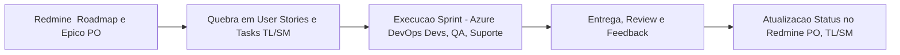

# Integração Redmine (Macro) & Azure DevOps (Micro) — Governança e Operação

---

## Objetivo

Estabelecer a integração entre Redmine e Azure DevOps para garantir visão macro (roadmap estratégico) e micro (execução operacional) do trabalho da equipe de desenvolvimento, com responsabilidades claras entre PO e TL/SM.

---

## 1. Visão Geral

- **Redmine**: Ferramenta de gestão macro, utilizada para roadmap, releases e acompanhamento de épicos e objetivos estratégicos.
- **Azure DevOps**: Ferramenta operacional de sprint, onde ocorre o detalhamento das histórias, tarefas, bugs e acompanhamento do ciclo ágil.
- **Responsabilidade principal:**
  - **PO (Product Owner)**: Responsável pelo planejamento, atualização e comunicação do roadmap e releases no Redmine.
  - **Tech Lead / Scrum Master (TL/SM)**: Responsável pelo detalhamento, execução e acompanhamento das demandas no Azure DevOps.

---

## 2. Fluxo Integrado Macro x Micro

1. **Planejamento Macro (Redmine) — PO**
   - Define visão, épicos, releases e objetivos estratégicos.
   - Compartilha roadmap com stakeholders, gerente e TL/SM.
   - Atualiza status dos épicos/releases conforme entregas.

2. **Quebra Operacional (Azure DevOps) — TL/SM**
   - Revisa backlog macro no Redmine junto ao PO.
   - Quebra épicos do Redmine em User Stories, Tasks e Bugs detalhados no Azure DevOps.
   - Define critérios de aceite e planeja sprint com o time (Dev, QA, Suporte).

3. **Execução & Acompanhamento — TL/SM, Time**
   - Time executa tarefas no Azure DevOps.
   - QA valida critérios de aceite.
   - Suporte N1 registra incidentes e alimenta backlog operacional.
   - TL/SM aprova PRs, publica releases, remove impedimentos e monitora execução diária.

4. **Feedback & Aprimoramento**
   - Ao final de cada sprint, TL/SM e PO atualizam status dos épicos/release no Redmine.
   - Ajustes estratégicos são discutidos pelo PO, TL/SM e gerente.
   - Compartilhamento de aprendizados e propostas de melhoria contínua.

---

## 3. Responsabilidades Resumidas

| Ferramenta      | Responsável Principal | Colaboradores                   | Foco                                  |
|-----------------|----------------------|----------------------------------|---------------------------------------|
| Redmine         | PO                   | Gerente, TL/SM                  | Roadmap, releases, épicos (macro)     |
| Azure DevOps    | TL/SM                | Devs, QA, Suporte, PO           | Sprint, execução, tarefas (micro)     |

---

## 4. Boas Práticas

- **Atualização periódica**: Roadmap e releases no Redmine devem ser revisados a cada ciclo ou entrega relevante.
- **Transparência**: Mudanças no macro (Redmine) devem ser comunicadas rapidamente ao time de execução (Azure).
- **Rastreabilidade**: Sempre referenciar o épico Redmine relacionado ao detalhar User Stories ou Tasks no Azure DevOps.
- **Alinhamento constante**: TL/SM e PO devem sincronizar frequentemente para garantir aderência entre planejamento estratégico e execução operacional.
- **Feedback cíclico**: Aprendizados do micro (Azure DevOps) devem retroalimentar o macro (Redmine).

---

## 5. Exemplo Visual do Fluxo

---

**Este documento orienta a equipe sobre o melhor uso combinado de Redmine e Azure DevOps, promovendo governança, clareza de responsabilidades e entrega ágil e alinhada ao roadmap estratégico.**