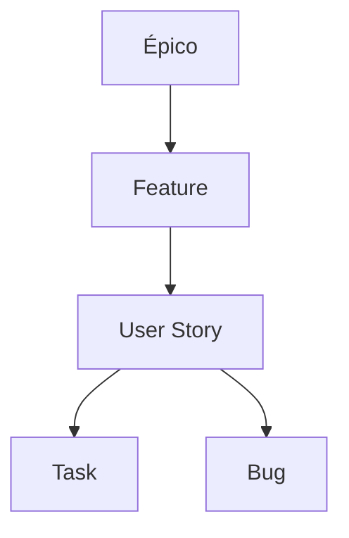

# Plano Azure DevOps - Estrutura de Épicos, Tarefas, Bugs

---

## Objetivo

Padronizar o uso do Azure DevOps para organização de backlog, épicos, tarefas e bugs.

---

## Hierarquia

- **Épico:** Grande iniciativa ou macro funcionalidade.
- **Feature:** Deliverable intermediário de um épico.
- **User Story:** Unidade funcional, focada na entrega de valor.
- **Task:** Item executável, granular.
- **Bug:** Correção de erro identificado. Sempre que possível, crie o bug como **child da User Story** correspondente.

---

## Exemplo Visual

---

## Boas Práticas

- Sempre vincule tarefas e bugs à User Story correspondente quando houver relação clara.
- Preferencialmente, crie bugs como **child** da User Story, garantindo rastreabilidade.
- Bugs críticos devem ser destacados no board do time.
- Revisar backlog semanalmente para garantir que bugs filhos estejam sendo tratados junto à US.

---

## TO DO

- Definir marcadores (tags/labels) padronizados de identificação para Épicos, Features, User Stories, Tasks e Bugs.
- Exemplos de marcadores:  
    - `#epic`, `#feature`, `#userstory`, `#task`, `#bug`
    - Ou usar convenção de nomes nas descrições/títulos (ex: `[EPIC]`, `[BUG]`, etc.)
- Padronizar uso dos marcadores em todo o time.
- Documentar exemplos de uso dos marcadores em cards reais do board.

---