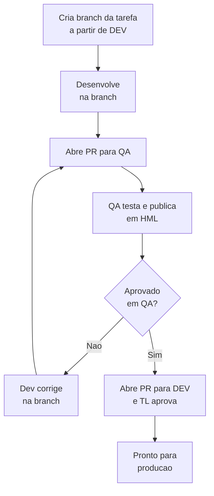
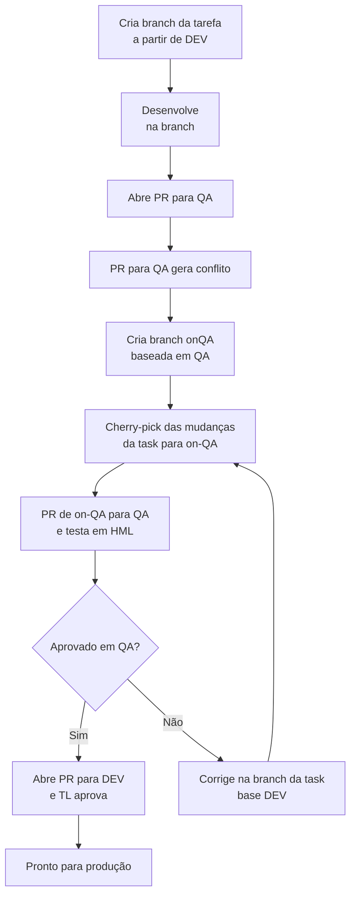

# Política de Branches: Fluxo para Pull Requests (PRs), QA e Exceções

---

## Objetivo

Padronizar o fluxo de trabalho de branches, pull requests (PRs) e publicação, garantindo:
- Rastreabilidade por tarefa
- Qualidade e previsibilidade
- Facilidade de rollback e troubleshooting
- Controle absoluto do que vai para produção

---

## 1. Estrutura de Branches

- **main/master**: Produção. Apenas código testado, aprovado e pronto para release.
- **dev**: Linha principal de desenvolvimento. Só recebe código aprovado no QA.
- **qa**: Para testes de homologação. Reflete o que está sendo testado.
- **feature/*** ou **bugfix/***: Branches de tarefa, sempre criadas a partir de **dev**.

---

## 2. Fluxo Normal por Tarefa

### Descrição do fluxo:

1. Crie a branch da tarefa a partir de **DEV**.
2. Desenvolva normalmente na branch.
3. Ao terminar, abra **PR para QA**.
4. O time valida/testa a PR de QA e publica em HML.
5. Se NÃO aprovado, dev corrige na branch da tarefa e recomeça o teste em QA.
6. Se aprovado, **abra PR para DEV** e TL aprova (mergeia).
7. Pronto para produção.

---

## 3. Fluxo de Exceção (quando PR para QA gera conflito difícil)

### Descrição do fluxo de exceção:

1. Se a PR da task para QA der conflito difícil:
    - Crie uma branch **on-QA** baseada em QA.
    - Faça **cherry-pick** apenas do que mudou na branch da tarefa para **on-QA**.
2. Teste a branch **on-QA** normalmente.
3. Se precisar ajustar, ajuste na branch da tarefa e repita o cherry-pick para **on-QA**.
4. Quando aprovado, abra PR para DEV e TL aprova (mergeia).
5. Pronto para produção.

---

## 4. Regras & Observações

- Nunca faça merge de QA para DEV.
- Sempre mantenha a branch da tarefa como referência para merge em DEV.
- Branch on-QA só existe para resolver conflitos na PR para QA.
- DEV só recebe código aprovado e testado em QA.
- Deploy de produção sempre parte de DEV.
- Sempre sincronize as correções entre a branch da task (base DEV) e a branch on-QA via cherry-pick.
- Nunca desenvolva diretamente na branch on-QA; utilize apenas para resolução de conflitos via cherry-pick.
- O histórico e rastreabilidade por tarefa são prioridade.

---

## 5. [TO DO] Convenções de Nome e Checklist de PR

- **Branches:** `feature/NOME_DA_FEATURE` ou `bugfix/NOME_DO_BUG`
- **PRs devem conter:**
    - Descrição clara do objetivo da tarefa
    - Checklist de critérios de aceite
    - Evidências (prints, logs, links de tarefa)
    - Indicação se precisou usar fluxo de exceção/on-QA

---

*Dúvidas? Consulte este documento ou fale com o TL antes de qualquer merge fora do padrão!*