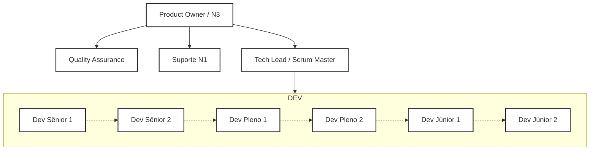

# Plano de Estrutura e Operação da Equipe de Desenvolvimento

## Sumário
- Estrutura da equipe (10 pessoas)
- Hierarquia e papéis
- Responsabilidades detalhadas
- Integração de ferramentas: Roadmap no Redmine e Sprints no Azure DevOps
- Fluxo de trabalho sugerido
- Exemplos de tarefas por papel
- Observações finais

---

## 1. Estrutura da Equipe (10 pessoas)

| Função                  | Qtde |
|-------------------------|:----:|
| Product Owner (PO) / N3 |  1   |
| Tech Lead / Scrum Master|  1   |
| Quality Assurance (QA)  |  1   |
| Suporte N1              |  1   |
| Dev Sênior              |  2   |
| Dev Pleno               |  2   |
| Dev Júnior              |  2   |
| **Total**               |**10**|

---

## 2. Hierarquia e Papéis

---

## 3. Responsabilidades Detalhadas

### Product Owner (PO) / N3
- Responsável pelo backlog, requisitos, priorização e alinhamento com o negócio.
- Responsável principal pelo roadmap no Redmine: cria e atualiza épicos, releases e visão macro.
- Escalonamento e decisões técnicas/funcionais de Nível 3.
- Lidera QA e Suporte N1.
- Compartilha visão com stakeholders e participa da transição do macro (Redmine) para micro (Azure DevOps).

### Tech Lead / Scrum Master
- Define padrões técnicos, realiza code reviews, mentoria e apoio à arquitetura.
- Remove impedimentos técnicos e acompanha evolução dos devs.
- Facilitador das cerimônias ágeis e gestor da sprint no Azure DevOps: detalhamento de histórias, planejamento e acompanhamento da execução.
- Aprovação de PRs e publicação em produção: valida checklist de deploy, coordena com QA e garante rollback rápido.
- Garante integração entre o roadmap macro (PO/Redmine) e o planejamento operacional (Azure DevOps).
- Coordena diretamente os desenvolvedores.

### Quality Assurance (QA)
- Subordinado ao PO.
- Planejamento, execução e automação de testes.
- Validação de critérios de aceite e qualidade das entregas.
- Reporte e acompanhamento de bugs, geração de métricas de qualidade.
- Participa do detalhamento de histórias e valida releases.

### Suporte N1
- Subordinado ao PO.
- Atendimento inicial ao usuário/cliente, registro e triagem de chamados.
- Solução de problemas simples e atualização de base de conhecimento.
- Reporta feedbacks recorrentes ao time e elabora relatórios de atendimento.

### Desenvolvedores
- **Sênior:** Liderança técnica, solução de desafios complexos, apoio ao TL/SM.
- **Pleno:** Execução principal das demandas, apoio aos juniores, revisão de código.
- **Júnior:** Execução de demandas simples, aprendizado, apoio ao time.

---

## 4. Integração de Ferramentas

### Redmine (Roadmap Macro)
- **Responsável:** Product Owner (PO)
- **Colaboradores:** TL/SM
- **Funções:**  
  - Definir visão, objetivos, releases e épicos.
  - Atualizar e compartilhar o roadmap.
  - Revisar periodicamente entregas macro com TL/SM.

### Azure DevOps (Sprint & Execução Operacional)
- **Responsável:** Tech Lead / Scrum Master
- **Colaboradores:** Devs, QA, PO, Suporte N1
- **Funções:**  
  - Quebrar épicos do Redmine em histórias/tarefas detalhadas.
  - Detalhar critérios de aceite em conjunto com QA/PO.
  - Planejar e rodar sprints (planning, daily, review, retro).
  - Aprovar PRs, coordenar deploys, remover impedimentos e acompanhar execução diária.

---

## 5. Fluxo de Trabalho Sugerido

1. **Roadmap no Redmine (PO)**
    - Definição de visão, releases, épicos e funcionalidades macro.
    - Compartilhamento periódico com TL/SM e stakeholders.

2. **Planejamento Sprint no Azure DevOps (TL/SM)**
    - Revisão do backlog macro com PO.
    - Quebra dos épicos em histórias/tarefas detalhadas.
    - Planejamento da sprint junto ao time, priorizando demandas do roadmap.
    - Detalhamento dos critérios de aceite (com apoio do QA).
    - Montagem do board de tarefas.

3. **Execução e Acompanhamento (TL/SM, Devs, QA, Suporte)**
    - Execução das tarefas/histórias.
    - QA valida critérios de aceite.
    - Suporte N1 registra incidentes que alimentam o backlog operacional.
    - TL/SM aprova PRs e publica em produção.
    - Dailies, reviews e retrospectivas documentadas no Azure.

4. **Feedback e Aprimoramento**
    - Atualização do status dos épicos/releases no Redmine após cada sprint.
    - Ajustes estratégicos discutidos em conjunto (PO, TL/SM).
    - Compartilhamento de aprendizados e propostas de melhoria contínua.

---

## 6. Exemplos de Tarefas Ricas por Papel

### Product Owner / N3
- Atualizar roadmap no Redmine, priorizar épicos e releases.
- Quebrar demandas macro em conjunto com TL/SM para detalhamento operacional.
- Validar critérios de aceite e analisar entregas ao final de cada ciclo.
- Tomar decisões/escalonamentos N3 (ex: dúvidas técnicas/funcionais, gargalos críticos).
- Liderar QA e Suporte N1.

### Tech Lead / Scrum Master
- Definir padrões de arquitetura e boas práticas junto ao time.
- Realizar code reviews criteriosos e sugerir melhorias.
- Aprovar Pull Requests, garantindo qualidade e segurança.
- Gerenciar e executar o processo de publicação em produção.
- Facilitar reuniões ágeis, garantir status e alinhamento das tarefas.
- Desenvolver planos de capacitação e promover workshops técnicos.
- Monitorar métricas (burndown, lead time, qualidade) e compartilhar resultados.

### QA
- Elaborar planos de teste para cada sprint.
- Automatizar testes de funcionalidades críticas.
- Reportar bugs com detalhes e evidências.
- Participar de refinamentos para antecipar riscos.
- Gerar relatórios de qualidade.

### Suporte N1
- Atender chamados em até X horas.
- Atualizar base de conhecimento semanalmente.
- Elaborar relatório mensal de atendimento.
- Sugerir melhorias de UX baseadas em feedbacks de usuários.

### Desenvolvedores
- Implementar features conforme planejamento.
- Realizar code reviews entre pares.
- Documentar implementações.
- Participar de cerimônias ágeis e contribuir para melhoria do processo.

---

## 7. Observações Finais

- **Comunicação:** Incentivar troca aberta e colaborativa.
- **Documentação:** Manter documentação técnica e de processos sempre atualizada.
- **Capacitação:** Prever trilhas de desenvolvimento para todos os papéis.
- **Saúde do time:** Monitorar sobrecarga, promover integração e bem-estar.

---

**Este plano pode ser facilmente adaptado para apresentação formal, onboarding de novos membros e acompanhamento de evolução do time.**